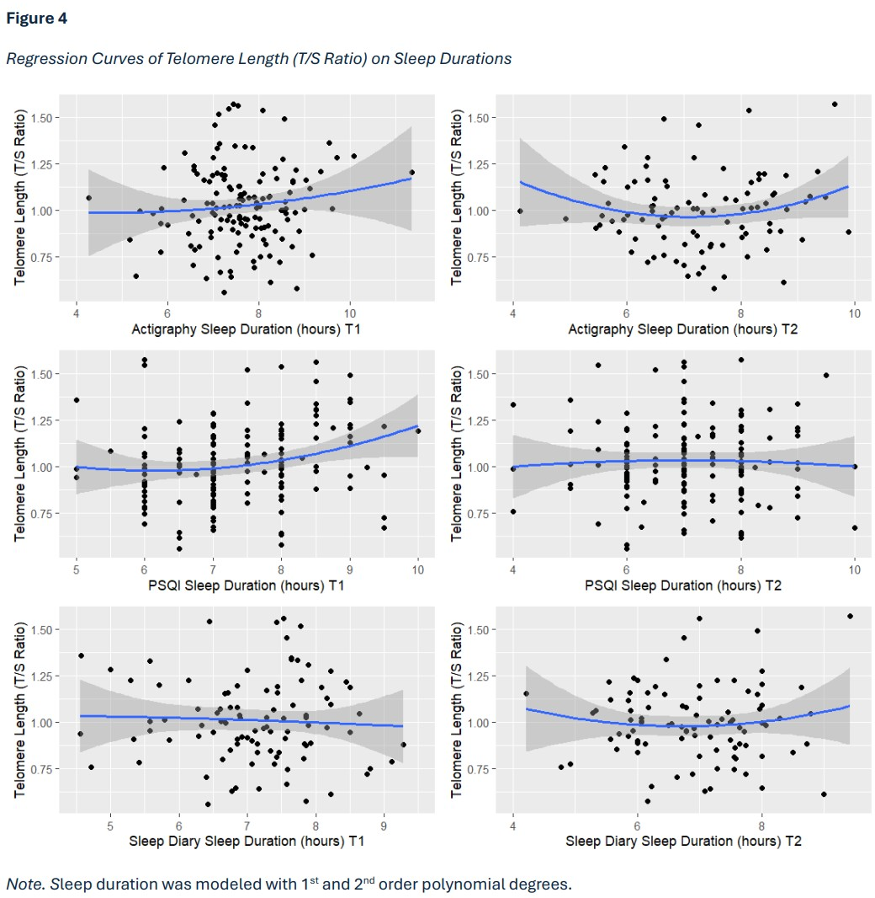
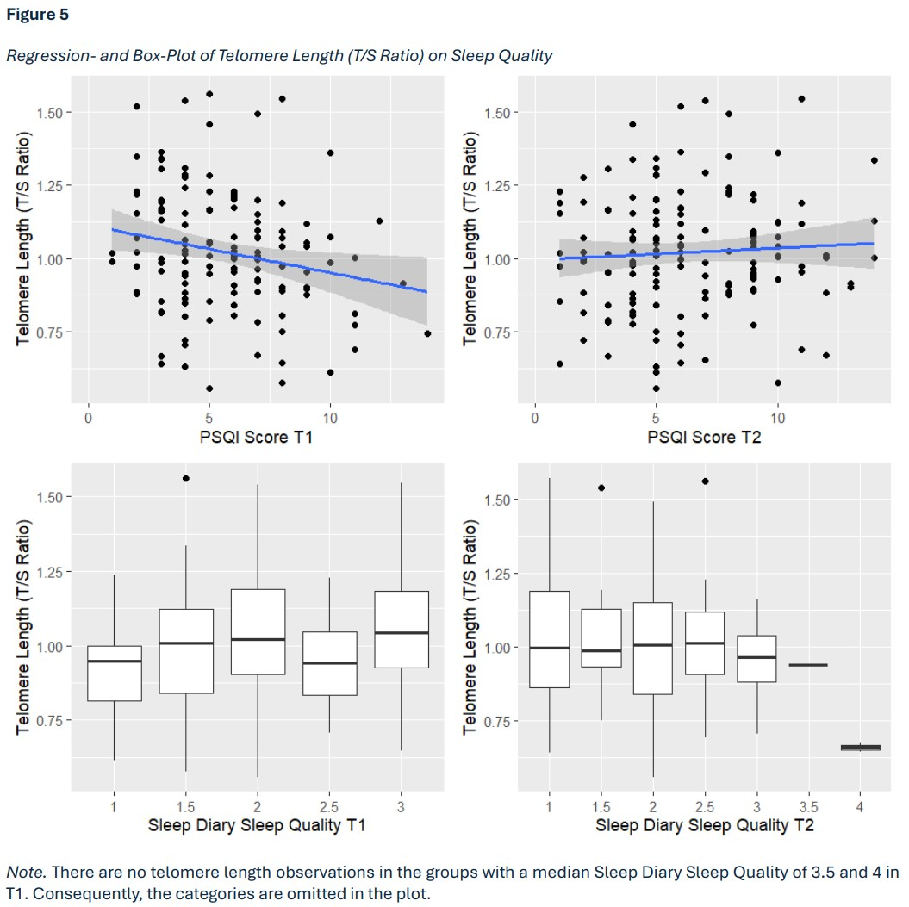
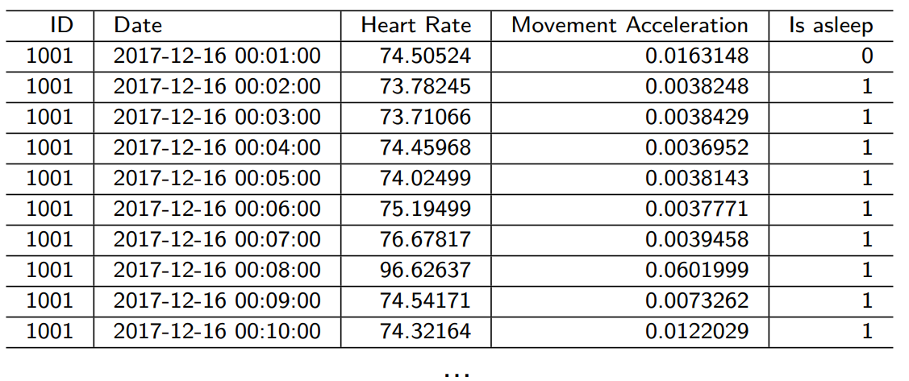
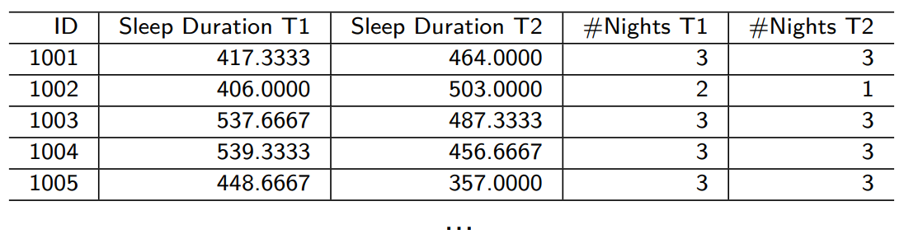

<link rel="stylesheet" type='text/css' href="https://cdn.jsdelivr.net/gh/devicons/devicon@latest/devicon.min.css" />

# :dna: Maternal sleep duration and quality during pregnancy and newborn telomere length: A prospective study with objective and subjective sleep measures.

> ⚠️ This repository was created to **showcase my Master’s thesis** and includes:
> - The `R` scripts used for data preprocessing and analysis  
> - The final written thesis report (PDF)  
> - A summary of the project in this README  
> 
> Please note:
> - This is **not a full reproduction** of all the work I have done during the thesis  
> - **Due to legal and ethical restrictions, the dataset is not included** 
>
> To inspect the technical part of my work (data preprocessing and analysis) see [Technical Background](#:computer:-technical-background)

## :books: Introduction

Telomere length at birth is considered a potential biomarker of age and health in later life. There is evidence that telomere length is influenced by lifestyle factors, which have been shown to play a role in promoting longevity. However, there remains considerable uncertainty about the precise factors that regulate the telomere system.  The *fetal programming hypothesis of telomere biology* postulates that telomere length is primarily influenced by intrauterine conditions (biophysical, clinical, psychological and behavioural) during pregnancy. These conditions are transmitted to the fetus through oxidative, immune, endocrine and metabolic pathways. Maternal sleep duration and quality have been proposed as potential contributors to fetal telomere programming, as sleep disturbance affects all of these pathways.

## :question: Hypotheses

It is recommended that adults get between seven and nine hours of sleep per night. An inverted U-shaped relationship is therefore hypothesised between maternal sleep duration and newborn telomere length. A positive linear association is postulated for sleep quality.

## :microscope: Methods

A total of 475 healthy pregnant women were recruited for a prospective longitudinal cohort study. Participants attended two laboratory visits during the first and third trimesters of pregnancy. Following each visit, a four-day ecological momentary assessment (EMA) was conducted to measure subjective and objective sleep variables. Subjective sleep quality and sleep duration were assessed through a sleep
questionnaire and a sleep diary. Objective sleep duration was measured using chest actigraphy over four consecutive days. Newborn telomere length was measured in isolated cord blood mononuclear cells collected at birth using quantitative polymerase chain reaction (qPCR).

## :chart_with_upwards_trend: Results

### Sleep Duration

### Sleep Quality

  
    

# :computer: Technical Background
This section showcases the technical workflow behind my Master's thesis and is centered around the preprocessing and statistical analysis of sensor data.

## :wrench: Tools & Environment
- **Language:** <i class="devicon-r-plain colored"></i>
- **Libraries:** `ggplot2`, `roxygen2`, `todor`
- **Version Control:** <i class="devicon-git-plain colored"></i>
- **Structure:** Modular `R` scripts with orchestrated execution (see [scripts/](scripts/))

## :signal_strength: Data Overview

- **Source:** ~300 sensor files (minute-level resolution)

- **Measurements:** Two time points, 4 days each
- **Goal:** Extract nightly sleep duration based on sensor activity 

## :fast_forward: Preprocessing Workflow
1. Find fall asleep time for each evening
    - Must occur between 20:00 and 04:00
    - First sleep phase ≥ 30 minutes
2. Find wake-up time
    - Must occur between 04:00 and 12:00
    - First wake phase ≥ 90 minutes
3. Daily/nightly aggregation
    - Days with >10% missing data were excluded
4. Measurement-period aggregation
    - Aggregated sleep duration across each of the two periods
5. Data integration
    - Final dataset includes joined sleep questionnaire data, telomere length, covariates and additional questionnaires

:information_source: **For more details on the preprocessing algorithm see the [Program Flow Chart](img/preprocessing-plan_flow-diagram.png). Note: The program flow chart does not exactly represent the algorithm as minor changes were applied afterwards.**

## :bar_chart: Statistical Analysis
- **Model Type:** Linear Regression
- **Non-linearity:** Modeled via 2nd-order polynomial for sleep duration to capture an inverse U-shaped effect
- **Goal:** Test associations between sleep (duration/quality) and newborn telomere length

## :wrench: Code Structure

The entire workflow is organized in the scripts/ folder. Key features:
- `build_data_frame.R`: Entry point to generate the final analysis-ready dataset. It orchestrates all downstream scripts.
- Modular function files (e.g., `sensor_functions.R` -> `sensor_preprocessing.R`) contain reusable code for data handling.

## :chart_with_upwards_trend: Visulatization
All figures were generated using ``ggplot2``, with custom visualizations for distributions, model predictions, and interaction effects.

## :warning: Challanges Addressed
- Defining accurate sleep/wake events with real-world sensor noise
- Handling incomplete days and asynchronous start times
- Managing multi-source data integration robustly
