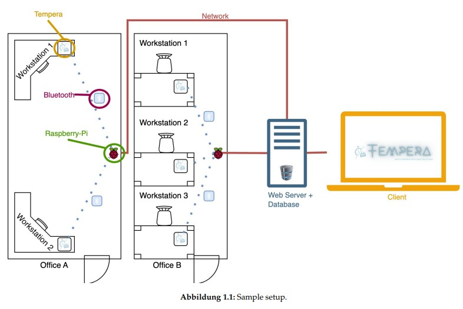

<link rel="stylesheet" type='text/css' href="https://cdn.jsdelivr.net/gh/devicons/devicon@latest/devicon.min.css"/>

# :pager: Tempera – Smart Workplace Monitoring

> :warning: This project was developed as part of the university course *PS Software Engineering* at the University of Innsbruck.  
> The README for the official course submission can be found under [Submission Readme](README_submission.md).  
>   
> The project was implemented by a team of five people. **Together with two other team members, I was responsible for implementing the Java-based web application.**  
>   
> Due to licensing restrictions, parts of the project have been removed. Therefore, this repository serves as a showcase of the project and is not a fully executable system. You can find a quick visual demo here:  [Showcase](presentations/demo.md).
> The source code of the `Java`-based Web Application can be found in [src/](src/)

## :bulb: Project Overview

Tempera is a smart device installed at the employee's desk, which:
- records working hours and working status at the push of a button,
- displays the current working mode (e.g., deep work, meeting),
- continuously measures the indoor climate (temperature, humidity, etc.).

The device communicates via Bluetooth Low Energy (BLE) with a Raspberry Pi (Access Point), which collects the data and forwards it via a REST API to a central backend. A web application provides a user-friendly interface for managing, visualizing, and analyzing the data.

A detailed project description is available here: [Project Description (PDF)](artefacts/Projektidee.pdf)

## :clipboard: Architecture Overview

## :sparkles: Main Features

- **Status Switching via Button:** Four working modes (Present, Meeting, Deep Work, Out-of-Office) can be selected directly on the device.
- **Status Display:** The current working mode is shown via LED on the device and in the web application.
- **Indoor Climate Monitoring:** Continuous measurement of environmental conditions (e.g., humidity, light intensity).
- **Notifications:** Email and in-app alerts when climate thresholds are exceeded.
- **Time Tracking & Project Assignment:** Manage and correct time logs via the web application.
- **Device & User Management:** Central management of Tempera devices and access points, and their assignment to users.
- **Data Visualization:** Clear diagrams show working patterns and environmental data.
- **Team Overview:** Team leads can view activities of their team members.

A detailed list of project requirements can be found here: [Requirements PDF](artefacts/Anforderungsliste.pdf)

## :wrench: Tech Stack

**Hardware:**
-  Arduino as the Tempera Device  
  -     C / C++
  - Climate sensors  
  - Button & LED control unit  
  - Communication with access point via Bluetooth Low Energy (BLE)
-  Raspberry Pi as Access Point
    -  Python
    - Communication with backend via REST API

**Backend & Web Application:**
-  Java  
-  Spring Framework  
-  PostgreSQL Database  

**Other Tools:**
-  JUnit  
-  GitLab  
-  Maven
