---
output:
  pdf_document: default
  html_document: default
---
Software Konzept: Deadline V1 <b>15.03.2024</b>

[[_TOC_]]

# 1. System Overview

## 1.1. Goal and Target Group
The target group of the Tempera system is an office with employees, whose daily work-live shall be made easier. First 
of all it supports employees by recording their working hours. Another benefit of the system is that other employees 
can see the current work mode of their colleagues, without having to run through the office. 
The Tempera device additionally records the climate data of the workspace to improve the working-climate through 
warnings if specifically set limits are exceeded.  

## 1.2. Features
### Work Status and Time Recording
The working hours of employees are not just simply recorded but also divided in different work statuses, which can be
looked at by their colleagues. There are four predefined status modes: `Available`, `Meeting`, `Deep Work` and 
`Out of Office`. The employee can change their own status by pressing a button on the Tempera device. The current status
is then indicated by an LED  on the Tempera device as well as in the web application.
The employee can also call up the recorded history of his time recording including the different work modi with the 
corresponding time stamps via the web application and assigns the time to the projects that were worked on. The current 
status of a colleague can also be viewed there. 

### Climate Measurements
In addition to the status information, the temperature device integrates climate measurements. Sensors on the device 
measure room temperature, humidity, air quality and light intensity. If a measured value exceeds specific limits set by 
the company, the user is informed of the deviation in the climate parameters via the web application and by e-mail. 

## 1.3. User
The system allows different user roles. There are `Employee`, `Group Leader`, `Manager` (manages projects, assigns 
groups to group leaders) and `Administrator`. Depending on the role, specific access rights are assigned and customised 
views are made available in the web application.
Our focus is on protecting personal data and ensuring that only authorised personal has access to the data.

Tempera thus creates an automated solution for improving the indoor climate as well as recording working hours efficiently,
while ensuring everyone's right of data protection.

[comment]: # (Translated with DeepL.com)

# 2. Use Cases

> This section provides an overview of the actors and their requirements for the system.

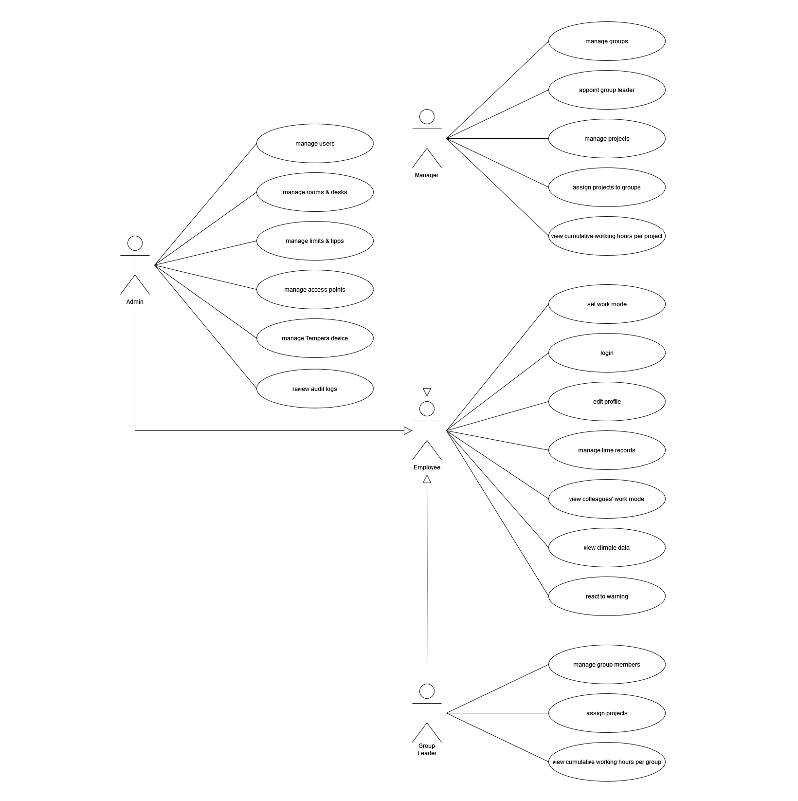

## 2.1. Employee

#### Use Case: Set Work Mode

Actor: Employee

Precondition: The tempera device is running and correctly connected to an access point.

Basic Flow:
- The user presses a button on their device to change their work mode.
- The device sends status updates to the web application.
- The web application updates the user's work mode accordingly and creates a new time record.

- Alternatives: 
- If the user presses a button twice while already in that mode, the open time record is saved and a new one is created, without the status being updated.
- If the user has selected a default project, the new time record is automatically assigned to this project.

Postconditions: The users status is correctly reflected in the system. A new time record is created.

Involved Business Classes: TemperaDevice, WorkMode, TimeRecord (c), Project

#### Use Case: Login

Actor: Employee

Basic Flow:
- The user navigates to the login page.
- The user enters their username and password.
- The system validates the credentials.
- If the credentials are valid, the user is logged in and directed to the home page.

Alternatives: 
- If the credentials are invalid, an error message is displayed and the user is not logged in.

Involved Business Classes: User, UserRole

#### Use Case: Edit Profile

Actor: Employee

Precondition: The employee is logged in.

Basic Flow:
- The user navigates to the profile section.
- The user has the possibility to set their work mode visibility to ‘public’ (default), ‘private’ or ‘hidden’, unless they have the role Admin.
- The user has the possibility to update their personal info.
- The user saves the changes, and their work mode visibility is updated in the system.

Alternatives: 
- If the user is an admin, they cannot change their work mode visibility from ‘public’, but can edit other personal information.

Involved Business Classes: User (m), UserRole, WorkModeVisibility

#### Use Case: Manage Time Records
Actor: Employee

Preconditions: The employee is logged in.

Basic Flow:
- The user navigates to the time records management section.
- The user sees an overview of their work history.
- They have the possibility to filter their work history by project and/or work mode.
- The user selects the time record they wish to manage.
- The user can assign the time record to a specific project.
- The user can add a description.
- The user can split or adjust the time record to reflect accurate work hours.
- When the user saves the changes, the time record is updated in the system.

Involved Business Classes: User, UserRole, TemperaDevice, TimeRecord (m) (c), Group, Project, WorkMode

#### Use Case: View Colleagues' Work Mode

Actor: Employee

Preconditions: The employee is logged into the web application.

Basic Flow:
- The user navigates to the colleagues section.
- The user uses the designated search bar to search for a colleague.
- The desk and the current work mode of the colleague is shown if their work mode visibility is set to public. 

Alternatives:
- If no user with the specified name was found, an an error message is displayed.
- If the colleague’s work mode visibility is set to ‘hidden’ no information about their work mode is displayed.
- If the colleague’s work mode visibility is set to ‘private’, the work mode is only displayed if the acting user is part of the same group as their colleague. 

Involved Business Classes: User, UserRole, WorkModeVisibility, WorkMode, TemperaDevice

#### Use Case: View Climate Data

Actor: Employee

Preconditions: The employee is logged into the web application.

Basic Flow:
- The user navigates to the time climate data section.
- The user sees the current measurements from their desk as well as the limits for their room.
- They also see an overview of past climate data.

Involved Business Classes: User, UserRole, TemperaDevice, ClimateMeasurement, ValueType, Room, Limit

#### Use Case: React to Warning

Actor: Employee

Preconditions: A measurement from the sensor station is out of the normal range as specified by the limits for the room for longer than 5 minutes.

Basic Flow:
- The user receives an e-mail with the relevant information, including which value is above or below the limit and what actions they can take.
- If the user is logged into the web app, they also see the same warning within the application. 
- Via a button click, the user confirms that they have seen the warning. The status of the warning is updated and no more warnings for this type of measurement will be sent for the next 15 minutes.
- The user can also click on a button in order to ignore warnings of this kind. The status of this warning as updated and no more warnings for this type of measurement will be sent for the next hour.

Alternatives:
- The user does not react to the warning. Another warning is sent if the value is still out of the normal range after 5 minutes, unless the user’s work mode is set to Meeting or Out-of-Office. In this case, no action is taken until they change their work mode. If the work mode is not changed within 30 minutes, the unseen warning is deleted. 

Involved Business Classes: User, UserRole, TemperaDevice, Warning (m), ClimateMeasurement, ValueType, Room, Limit

## 2.2. Group Leader

#### Use Case: Manage Group Members 

Actor: Group Leader

Preconditions: The user is logged into the web application and has the role group leader.

Basic Flow:
- The user navigates to the group management section. 
- The user selects the group they wish to manage. 
- The user sees an overview of all group members and their current work mode.
- The user has the option to search for other users via a search bar and add them to the group.
- The user has the option to remove members from the group. 
- The user saves the changes, and the group membership is updated in the system.

Involved Business Classes: GroupLeader, Group (m), User, UserRole, WorkMode

#### Use Case: Assign Projects 

Actor: Group Leader

Preconditions: The user is logged into the web application and has the role group leader.

Basic Flow: 
- The user navigates to the project assignment section.
- The user selects the project they wish to assign to users/disassociate users from. 
- The user selects the groups/members they want to assign to the project. Alternatively, they can select groups/members who are already assigned to the project in order to disassociate them from it. 
- The user saves the changes, and the project assignments are updated in the system. 

Involved Business Classes: User, UserRole, Project (m), Group

#### Use Case: View Cumulative Working Hours Per Group

Actor: Group Leader

Preconditions: The user is logged into the web application and has the role group leader.

Basic Flow: 
•	The user navigates to the group management section. 
•	The user sees an overview of the cumulative working hours of all the groups they lead.
•	They can filter this information by group and/or work mode and see the respective cumulative working hours.
•	No individual user names or Tempera station IDs are displayed,  ensuring anonymity. 

Involved Business Classes: User, UserRole, Group, TemperaDevice, TimeRecord, WorkMode

## 2.3. Manager

#### Use Case: Manage Groups

Actor: Manager

Preconditions: The user is logged in and has the role manager.

Basic Flow:
- The user navigates to the group management section.
- The user has the option to create a new group.
- The user can edit the details of existing groups or delete groups.
- When the user saves the changes, the information is updated in the system.

Involved Business Classes: User, UserRole, Group (c) (m) 

#### Use Case: Appoint Group Leader

Actor: Manager

Preconditions: The user is logged in and has the role manager.

Basic Flow:
- The user navigates to the group management section.
- The user selects the group for which they want to appoint a group leader.
- The user searches for a user to be appointed as group leader via a search bar and selects one specific user.
- The user saves the changes. The selected user now has the role group leader and has access to all corresponding features for the selected group.

Involved Business Classes: User (m), UserRole, Group

#### Use Case: Manage Projects

Actor: Manager

Preconditions: The user is logged in and has the role manager.

Basic Flow:
- The user navigates to the project management section.
- The user has the option to create a new project. They must provide a name and a description.
- The user can edit existing project details or delete projects as needed.
- The user saves the changes, and the project information is updated in the system.

Involved Business Classes: User, UserRole, Project (c) (m) 

#### Use Case: Assign Projects to Groups

Actor: Manager

Preconditions: The user is logged in and has the role manager.

Basic Flow:
- The user navigates to the project management section.
- The user selects the project they wish to assign.
- The user chooses the group or groups to which they want to assign the project from a list of all groups.
- The user saves the changes, and the project assignments are updated in the system.

Involved Business Classes: User, UserRole, Project (m), Group

#### Use Case: View Cumulative Working Hours Per Project

Actor: Manager

Preconditions: The user is logged in and has the role manager.

Basic Flow: 
- The user navigates to the project management section. 
- The user sees an overview of the cumulative working hours of all their projects.
- They can filter this information by group, work mode, or timespan and see the respective cumulative working hours.
- No individual user names or Tempera device IDs are displayed, ensuring anonymity. 

Involved Business Classes: User, UserRole, Group, TemperaDevice, TimeRecord, WorkMode

## 2.4. Administrator 

#### Use Case: Manage Users

Actor: Administrator

Preconditions: The administrator is logged in.

Basic Flow:
- administrator navigates to the user management section.
- The administrator selects the user they wish to edit.
- The administrator edit can personal information such as name and password.
- The administrator can also assign roles to the user or revoke existing roles.
- The administrator can create new users by providing the necessary details.
- The administrator saves the changes, and the user information is updated in the system.

Involved Business Classes: User (m), UserRole

#### Use Case: Manage Rooms & Desks

Actor: Administrator

Preconditions: The administrator is logged into the web application.

Basic Flow:
- The administrator navigates to the room management section.
- The administrator has the option to create a new room.
- The administrator can select and a room in order to edit its details or delete it.
- The administrator can also add or delete desks.
- The administrator saves the changes, and the room information is updated in the system.

Involved Business Classes: User, UserRole, Room (c) (m), Desk (c) (m)

#### Use Case: Manage Limits & Tipps

Actor: Administrator

Preconditions: The administrator is logged into the web application.

Basic Flow:
- The administrator navigates to the room management section.
- The administrator can select and a room in order to edit its limits. They must provide a reason why the limit was changed.
- The administrator can edit the message that contains tips concerning what to do if the measurements are outside of the range established by the limits.
- When the administrator saves the changes, and the information is updated in the system.

Alternatives:
-	If no reason for the change of a limit is provided, an error message is displayed and the information is not updated.

Involved Business Classes: User, UserRole, Room (m), Limit (c) (m)

#### Use Case: Manage Access Points

Actor: Administrator

Preconditions: The administrator is logged into the web application.

Basic Flow:
- The administrator navigates to the hardware management section.
- The administrator has the option to add new access point within the system. They then use the generated ID to configure the hardware. The access point’s status is set to disabled.
- The administrator can enable or disable access points and stations.
- The administrator can assign access points to rooms.
- When the administrator saves the changes, and the information is updated in the system.

Alternatives:
-	If the setup process fails, an error message is displayed.

Involved Business Classes: User, UserRole, AccessPoint (c) (m), Room (m)

#### Use Case: Manage Tempera Device
Actor: Administrator

Preconditions: The administrator is logged into the web application.

Basic Flow:
- The administrator navigates to the hardware management section. 
- The administrator has the option to add new Tempera devices within the system. They then use the generated ID to configure the hardware and registers the station to an access point.
- The administrator can change the access point a station is registered to.
- The administrator can enable or disable Tempera devices and can also permanently remove them from the system.
- The administrator can assign Tempera devices to users.
- When the administrator saves the changes, and the information is updated in the system.

Alternatives:
- If the setup process fails, an error message is displayed.

Involved Business Classes: User (m), UserRole, AccessPoint (m), TemperaDevice (c) (m), User (m)

#### Use Case: Review AuditLogs
Actor: Administrator

Preconditions: The administrator is logged into the web application.

Basic Flow:
- The administrator navigates to the audit log section.
- The administrator sees the latest audit logs.
- The administrator has the option to filter the displayed logs.

Involved Business Classes: User, UserRole, AuditLog

# 3. Class Diagramm

>This section contains a technical class diagram with corresponding textual explanations of the classes and their tasks as well as a deletion policy for the classes. 

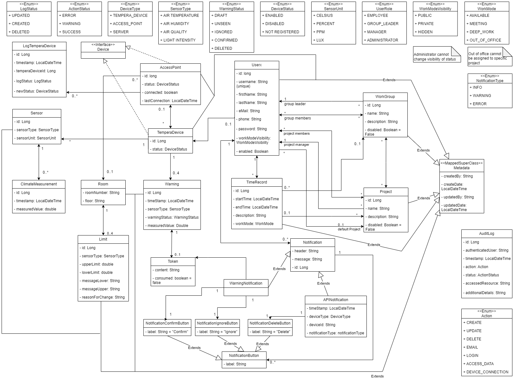

| Name                 | Responsibility                                                                                                                                                    |
|----------------------|-------------------------------------------------------------------------------------------------------------------------------------------------------------------|
| `User`               | Personal data of employees is stored in user objects. These objects are also connected to Tempera devices as well as WorkGroups and Projects the user is part of.                                                        |
| `UserRole`           | Serves to authenticate users for certain tasks / pass them certain responsibilities: EMPLOYEE, GROUP_LEADER, (project) MANAGER and ADMINISTRATOR.                                                                                |
| `WorkModeVisibility` | Defines by whom a user's work mode can be seen: by everybode, by group members or by nobody. The work mode of users with the user role 'Administrator' is always visible.                                                                                                  |
| `Room`               | Limits are set per room and access points are assigned to rooms. Rooms are identified by their room number.                                                                         |
| `Limits`              | Limits specify upper and lower threshold values for room climate measurements of a specific sensor type, as well as tipps on what to do, if these threshold values are exeeded/not reached. |
| `WorkGroup`              | WorkGroups consist of members and a group leader. WorkGroups work on projects. The Group leader assigns group members to the work group's projects.                                                                                            |
| `Project`            | Managers can create projects, assign them to work groups and determin a group leader.                                                                                                             |
| `DeviceStatus`       | The status of an access point or Tempera device: ENABLED, DISABLED or NOT REGISTERED                                                                                                                  |
| `TemperaDevice`      | The internal representation of a Tempera station.  It is connected to an access point and has several measuring sensors as well as a list of warnings, if there are any.                                                                                                           |
| `LogTemperaDevice`      | logs every change in the assignment of tempera devices to their access points as well as changes of the device status of tempera devices. This allows an access point to track which tempera devices are currently assigned to it and which device status they have.                                                                                                             |
| `LogStatus`        | stands for the type of change the LogTemperaDevice records: is a Tempera Device updated, created or deleted.                                                                                                        |
| `AccessPoint`        | The internal representation of a rasberry pi access point. It is situated in a room and is connected to a tempera device.                                                                                                        |
| `Device`        | An interface standing for devices in general. It is implemented by tempera devices and access points.                                                                                                        |
| `Sensor`        | Every sensor of a tempera device is resembled by a single sensor object with a specific sensor type and sensor unit in the web application. Its measurements are saved as a list of climate measurement objects.                                                                                                        |
| `SensorType`        | Defines which kind of value the sensor is measuring. It is not only used by climate measurements but also by limits and warnings.                                                                                                         |
| `SensorUnit`        | Defines the measuring unit of a specific sensor                                                                                                         |
| `TimeRecord`         | Keeps track of a users work hours and work mode. It can be assigned to work groups and projects the owning user is working on except when its work mode is  out_of_office.                                                                                                                 |
| `WorkMode`           | Four work modes are available to users: available, meeting, deep_work and out_of_office.                                                                                                                           |
| `ClimateMeasurement` | Represents a data point from a Tempera Device's sensor.                                                                                                          |
| `Warning`            | Indicates to the user that the room climate measurements are not within the limits.                                                                               |
| `Token`            | is used to indicate whether the associated warning is still active.                                                                               |
| `WarningStatus`      | Indicates if a user has seen a warning and taken action, chosen to ignore it, or not seen it at all. Furthermore the status DRAFT signals, that a limit transgression is detected but the user is not yet informed.                                                               |
| `Notification`            | comprises several sub classes that all informs its assigned user about events out of the ordinary.                                                                               |
| `NotificationButton`            | comprises several sub classes that all enables the user to react to his notifications.                                                                               |
| `APINotification`            | informs its assigned user about malfunction regarding the specified device.                                                                               |
| `NotificationType`            | defines the type of an API notification: INFO, WARNING or ERROR                                                                               |
| `DeviceType`       | defines which kind of device the APInotification concerns                                                                                                                   |
| `NotificationDeleteButton`            | enables the user to delete the APINotification it is assigned to.                                                                               |
| `WarningNotification`            | informs its assigned user about measured limit transgressions via the ui of the web application                                                                               |
| `NotificationConfirmButton`            | enables the user to delete the WarningNotification it is assigned to and set the warning status of the corresponding warning to "CONFIRMED".                                                                               |
| `NotificationIgnoreButton`            | enables the user to delete the WarningNotification it is assigned to and set the warning status of the corresponding warning to "IGNORED".                                                                               |
| `Medadata`            | enables the user to delete the WarningNotification it is assigned to and set the warning status of the corresponding warning to "IGNORED".                                                                               |
| `AuditLog`            | helps the audit aspect to record needed data about when and by whom changes are made.                                                                                |
| `Action`        | different types of actions that are recorded by the audit aspect.                                                                                                        |
| `ActionStatus`        | different types of statuses of an audit log's action: ERROR, WARNING, SUCCESS                                                                                                        |

## Deletion Policy
A WorkGroup or Project object will only be set to disabled; a User object will be taken its role (so it is unable to do any action) and its personal data is set to null. Furthermore all its memberships in WorkGroups and Projects are deleted. The User's TimeRecords remain in the database. They are still connected to the WorkGroups and Projects, so the accumulated time for Managers and GroupLeaders is not touched by the deletion of the User.

Deletion of a Room object is only possible, if no TemperaDevice is associated with it. By deleting a Room, also all its Limits are deleted.

A TemperaDevice object can only be deleted, if no User is connected to it. The connection must be removed beforehand to ensure that the user is registered to a new TemperaDevice and TimeRecord/ClimateMeasurement is not interrupted.

The same principle applies to AccessPoints: an AccessPoint object can only be deleted, if no TemperaDevice objects are connected to it. Also when an AccessPoint object is set to disabled, this is only permitted, if all connected TemperaDevice objects are disabled as well or if there are not any TemperaDevices connected at all.

All other classes have no special deletion policy.

# 4. SW Architecture

> This section documents the building block view (components of the system), runtime view (processes and relationships between components) and distribution view (description of the technical infrastructure of the system and its relationship to the components) based on the arc42¹ template.

> At the beginning of the project, create a corresponding component diagram of the system as well as sequence diagrams (runtime view) for the communication between the different system parts. In the final version at the end of the project, add diagrams for the distribution view of the system.

[comment]: # (Translated with DeepL.com)

[¹]: https://arc42.org (Zugriff: 17.02.2023)

## 4.1. Component View

### 4.1.1. Level 1

| Name          | Responsibility                                                                                                                                                                    |
|---------------|-----------------------------------------------------------------------------------------------------------------------------------------------------------------------------------|
| `Tempera`     | An Arduino device to measure room climate data, track working hours and set working mode status.                                                                                  |
| `Accesspoint` | A RaspberyPi which gathers the data from `Tempera`. It stores the data temporarily to a database until the data is sent to the `WebApplication` after a certain time interval.    |
| `WebApplication`| A web application for users to edit their working hours, see climate data, administrating the system and manage projects. See [Use Cases](#Use Cases) for a detailed description. |

### 4.1.2. Level 2

The `WebApplication` is a 3 layered pattern containing the presentation, application and persistence layers.
The `model` acts as a sidecar. 

| Name           | Responsibility                                                                                                                           |
|----------------|------------------------------------------------------------------------------------------------------------------------------------------|
| `ui`           | Contains standard ui classes and files. The component is built by `beans`, `controllers` and `.xhtml` files in the `webapp` component.  |
| `services`     | Implements the business process logic.                                                                                                   |
| `repositories` | Saves business classes persistently to the data base.                                                                                    |
| `model`        | Implements the business model from [Classdiagram](#Klassendiagramm).                                                                     |
| `auditing` | Logs the systems activity. An aspect oriented programming approach is taken. |
| `configs`      | Implements secuirty and additional configurations                                                                                        |

### 4.1.3. Level 3

| Name            | Responsibility                                                                                                                                                                     |
|-----------------|------------------------------------------------------------------------------------------------------------------------------------------------------------------------------------| 
| `Climate`       | Manages the `ClimateMeasurement` and climate `Warnings` sent to the user. Decides when to send `Warnings` to users.                                                                |
| `Room`          | Manages the `Room` objects including setting `Limit` for the climat measures.                                                                                                      |
| `TimeTracking`  | Implements management functionalities for `Manager` and `GroupLeader` and implements time recording (`Project`, `WorkGroup` and `TimeRecord` editing); see [User Roles](#Use Cases)). |
| `Notifications` | Listens to changes in `Warnings` and sends notifications to users via the webapplication and e-mail. Implements options for reacting to notifications.                             |
| `EmailService`  | Setup for sending email notifications to users.                                                                                                                                    |
| `LogService`    | Lists all log entries. Log methods are implemented in the respective services.                                                                                                     |
 
`AccessPointService`, `TemperaDeviceService` and `UserService` are standard service classes implementing CRUD methods for the corresponding classes.

### 4.1.4. Level 4

#### Notifications  

| Name                                                                                 | Responsibility                                                                  |
|--------------------------------------------------------------------------------------|---------------------------------------------------------------------------------|
| `TokenService`                                                                       | Manages `Token` for email notifications.                                        |
| `NotificationService`                                                                | Adds `Notification` to users and manages reactions to them via CRUD methods.    |
| `ListNotificationListener`, `EmailNotificationListener`, `ApplicationEventPublisher` | Listens to changes in `Warning` and sends notifications using listener pattern. |

#### TimeTracking  

| Name                 | Responsibility                                                                                                 |
|----------------------|----------------------------------------------------------------------------------------------------------------|
| `TimeRecordService`  | Provides methods CRUD methods for `TimeRecord` including helper functions for editing (e.g. `detectOverlap()`) |
| `WorkGroupService`   | CRUD methods for `WorkGroup` objects                                                                           |
| `ProjectService`     | CRUD methods for `Project` objects                                                                             |

#### Room

| Name                 | Responsibility                                                                                  |
|----------------------|-------------------------------------------------------------------------------------------------|
| `RoomService`        | CRUD methods for `Room` objects                                                                 |
| `LimitService`       | CRUD methods for `Limit` objects including helper functions for editing (e.g. `areLimitsValid`) |

#### Climate

| Name                 | Responsibility                                                            |
|----------------------|---------------------------------------------------------------------------|
| `WarningService`     | Manages climate warnings for users and CRUD methods for `Warning` objects |
| `ClimateMeasurementService` | CRUD methods for `ClimateMeasurement` objects to provide them to the user.|

All other classes are standard service classes implementing CRUD methods for the corresponding classes.

## 4.2. Runtime View

In this section the behavior of the system components is described by their communication with each other.
It will be divided into 3 different parts: 
- transmission of data (divided into general connections of an `AccessPoint`
and the different rest connections in specific)
- connection establishment (divided 
into 2 subsections - registration and reconnection)
- limit transgression

### 4.2.1. Data Transmission
This section is focused on the different types of data transmissions between the devices. Therefor we need to distinguish
between the regular connections on an `AccessPoint` (containing the detailed BLE connection), and the different types of 
rest transmission between `AccessPoint` and *Backend*, as in *Measurements*, *TimeRecords*, *TemperaDeviceUpdates* and *Messages*.

#### Access Point Connections
First up is the general connection loop of an `AccessPoint` and `TemperaDevice`s. The main actors are **Tempera Device 1**,
**Access Point 1**
and the *Backend*, as well as *Elvis* as an `Adinistrator` and *John Doe* as the `Employee` connected to **Tempera Device 1**.

At the top one can see the connection between **Tempera Device 1** and *Sensor*. The interaction is every 10 s and saves the
collected data in a cyclic array to summarize the data before sending it to the **Access Point 1** upon request.

Afterward the loop on the `AccessPoint` is displayed. The outer loop is every 5 minutes, where messages and measurements,
that are left in the database (e.g. when Wi-Fi is down) are sent.
Inside is a Loop every 1 minute, where the BLE connection takes place. Before starting the BLE connection, the `AccessPoint`
first requests the new Tempera Device Updates (request updates) described in *Rest Tempera Device Updates*. After that
the `AccessPoint` searches for all the enabled `TemperaDevice`s in the database and gets the data. If one of the devices
cannot be found, then a message containing information about the connection loss is saved and then sent to the *Backend*
relaying it to *Elvis* and *John Doe*.

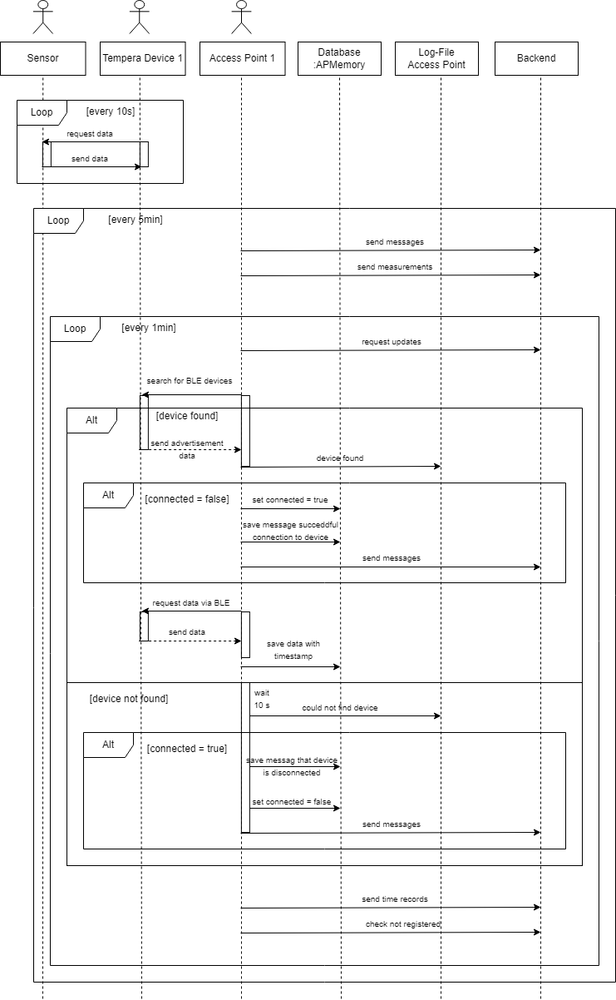

#### Rest Connections

##### Rest Measurement

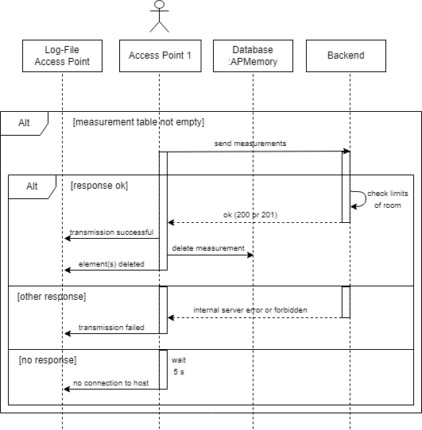

##### Rest Time Record

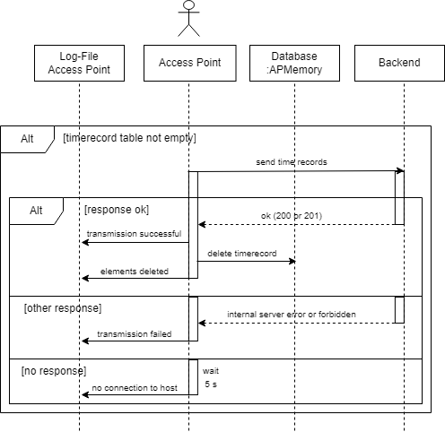

##### Rest Tempera Device Updates

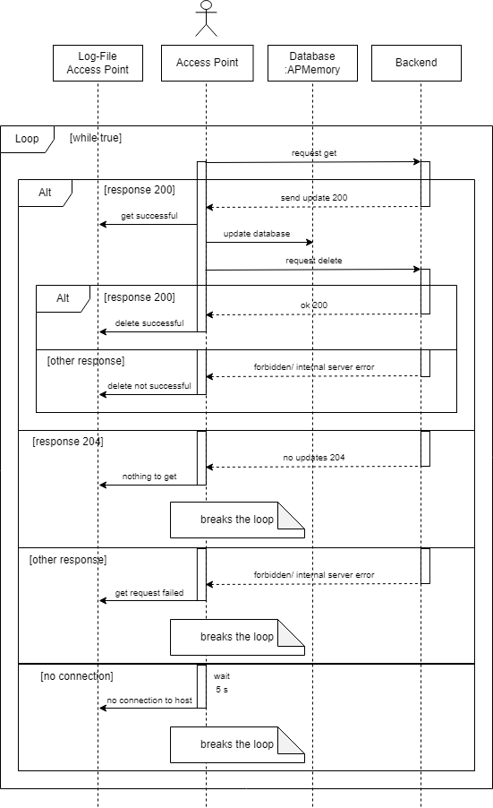

##### Rest Messages

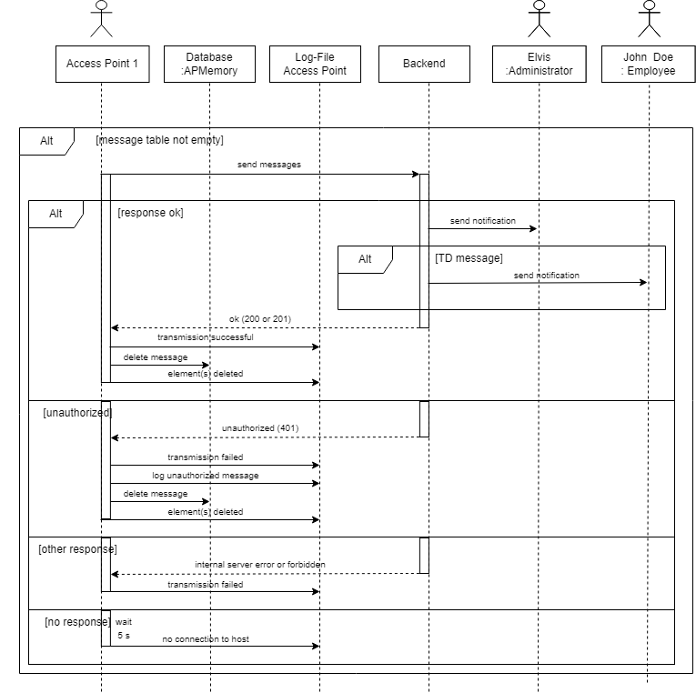

### 4.2.2. Connection Establishment
To be able to transmit data between our system components, as mentioned above, these devices have to be linked properly.
Therefor we first need to register a new device and if one of the devices looses its connection (due to power shortage or 
blootooth/WIFI error) this device has to be able to automatically reconnect with its corresponding devices.

#### Registration Process
The registration of a new device, be it a Raspberry Pi as an `AccessPoint` or an Arduino as a `TemperaDevice`, can
only be done by an `Administrator`. For the following sequence diagrams *Elvis* is an example `Administrator`.

###### AccessPoint
The first Registration we want to look at is the registration of a **RaspberryPi** as an `AccessPoint`. For this case
there are the actors, *Elvis*, *Access Point* (representing the device), as well as the *Backend*. Throughout the
process a new object **newAccessPoint** of the class `AccessPont` is created.

When *Elvis* the `Administrator` creates a new `AccessPont` the 
*Backend* will create the new object `AccessPont` and generate an ID. This ID has to be set in the configuration file on
the *Access Point* by the `Administrator`. Once this is done and the **Access Point** should send a notification to the 
*Backend* via rest, which is used to
verify the registration process. As long as that verification process has not been completed the `Administrator` can not
change the status of the newly created `AccessPoint`. Once the verification process is completed, *Elvis* will be notified
and from now on he can change the status of **newAccessPoint**.

Enabling of an `AccessPoint` has to be done manually by an `Administrator` (it doesn't have to be the same one though). 
This can be seen on the bottom of the diagram.

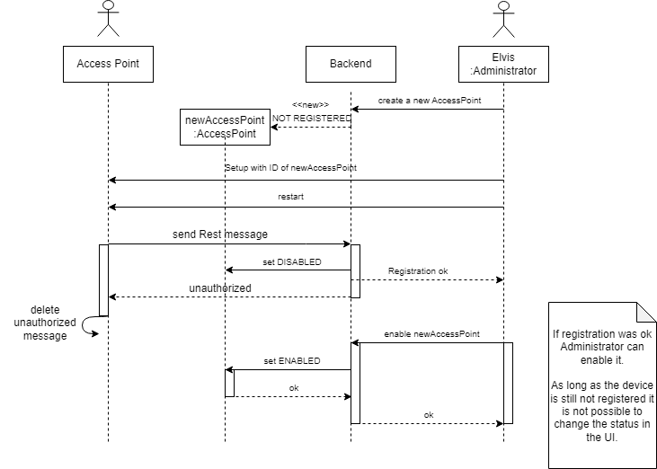

###### Tempera Device
The second kind of registration we have is that of an **Arduino** as a `TemperaDevice`. The actors needed for this
connection are *Elvis*, *Access Point*, *Tempera Device* and the *Backend*, as well as 
the `AccessPoint` object **accessPoint**, the newly created `TemperaDevice` object **newTemperaDevice** and different
`LogTemperaDevice` objects *log1*, *log2* and *log3*.

Here as well *Elvis* is the actor to create a new `TemperaDevice` object via the user interface and start the
registration process. After creating the object the ID again will be generated automatically, but has to be inserted into
the Tempera Device source code. Afterward, to register a `TemperaDevice`, an `AccessPoint` has to be selected for the connection 
to the *Backend*. (It can still be changed 
by an `Administrator` later on.) This creates a new object `LogTemperaDevice` that contains the necessary update- 
information for the `AccessPoint`. This object will be saved in the list of TemperaLogs in the `AccessPoint` object and 
sent to the corresponding device when an update request comes in via rest. Once the update has reached the *Access Point*
successfully it will be deleted on the *Backend*.

Once the 
**Access Point** can connect to the **Tempera Device** it sends a message to the *Backend* that the registration was successful.
Once the registration is confirmed on the *Backend* *Elvis* will be informed and can now change the status of the device.

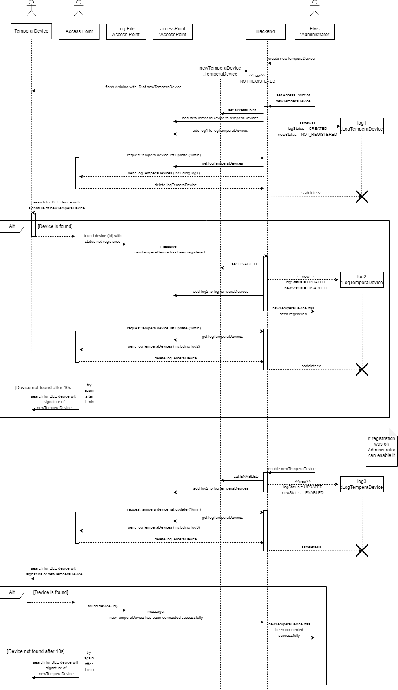

#### Reconnection
If one of the devices gets disconnected from the running system this is logged and the affected actors (e.g. *Backend*,
`Administrator`, `Employee` linked to the device) will be notified of the lost connection.
What may be even more important is how the device is able to connect itself again after losing the connection or a power
outage. Therefor we will look at the 2 external devices **Access Point** and **Tempera Device**.

###### Access Point
First up is the **Access Point**. The *Backend* is checking the lastConnection of each `AccessPoint` every minute if the
last Connection is older than 2 minutes (each `AccessyPoint` should connect itself once per minute, which you can see in 
the first section of 4.2.1 (Access Point Connections))
the connection loss will be logged (on the side of the *Back
End*) and all `Admin`s will be notified.

Once the **Access Point 1** is online again it will try to connect itself with the server. When the connection is established
successfully it will be logged and *Elvis* will be notified.

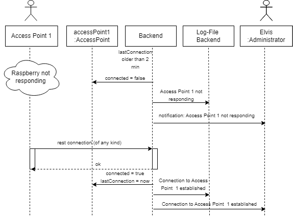

###### Tempera Device
A similar procedure takes place when one of the **Tempera Device 1**s looses its connection to its corresponding `AccessPoint` 
(**Access Point 1**). The **Access Point 1 is supposed to request the sensor-data every minute. If he doesn't get a response 
 it will be logged (on the side of the **Access Point 1**) and the *Backend* 
will be notified.  The connection loss will
then be reported to *Elvis* as well as the `Employee` who is connected to the specific `TemperaDevice`.

As soon as the **Tempera Device 1** is back it will send advertisement packages so that the **Access Point 1** can find it. Once 
the connection has been 
established successfully it is logged and the information is sent to the *Backend*.

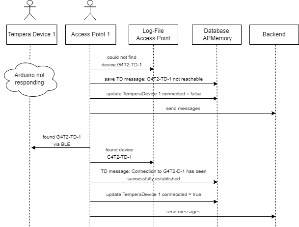

### 4.2.3. Limit Transgression
The algorithm for the warning system for limit transgression runs for a **single** value and thus, is independent of the state of other metrics.
The algorithm runs every time a new `ClimateMeasurement` object is created in the backend. The ranges for the metrics are saved in a limitsList for each `Room` consisting of four `Limits` objects - one for every `SensorType`.
The algorithm is as follows:

1. If the incoming `ClimateMeasurement` is older than 15 minutes, it will not be checked for limit transgressions at all.

2. If a value is out of the normal range, first of all a `Warning` with DRAFT-status is created with no further consequence for the time being.

3. If a limit transgression goes on for more than 5 minutes, the respective `Warning's` status is set to UNSEEN and is delivered to the user via UI and e-mail. 
These warning messages contain recommendations on how to bring back the values to a normal range. The user has the following options to react to the warning:
   1. `Confirm`: Confirms that the user has seen the warning and considers some counter actions. The status of the `Warning` is changed to CONFIRMED.
   2. `Ignore`: The user states that he ignores the `Warning` and does not take any action. The status of the warning is changed to IGNORED.

2. Depending on Szenario:
   1. Szenario `Confirm`:
   After 15 minutes go back to step 2 and delete the `Warning` object.
   2. Szenario `Ignore`: 
   After 1 hour go back to step 2 and delete the `Warning` object.
   3. Szenario *no reaction*: After 30 minutes the WarningService checks the user's `WorkMode`:
      1. If the user is in `WorkMode` MEETING or OUT_OF_OFFICE reset `Warning's` timestamp.
      2. Otherwise delete the `Warning` object and go back to step 2.

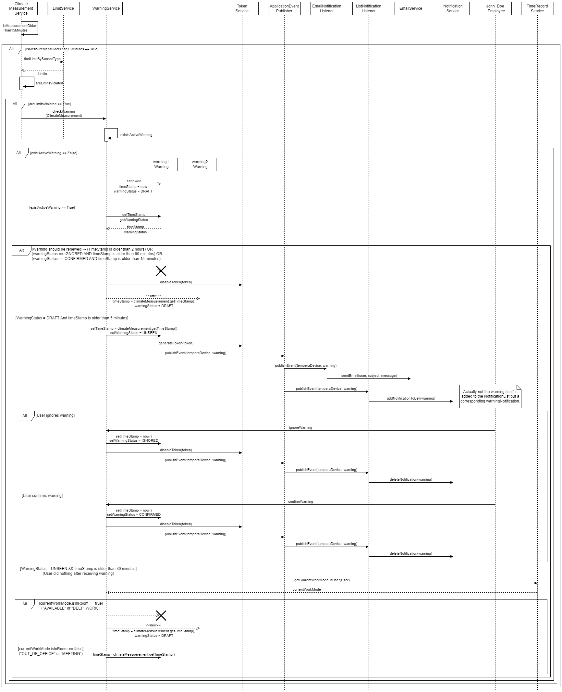

# 5. Limit Transgression
Every time climate measurements get recorded by the backend system, one by one will be evaluated, whether the measured values are within the defined limits for the room the tempera device is situated in. A warning will be created immediately in the system (in the first place only as a draft). If the transgression lasts for more than 5 minutes the warning will be sent by mail to the respective user. Simultaneously the warning is also displayed in the user's Web-App (see GUI prototype). The user can now actively ignore or confirm the warning by clicking the corresponding link in his mail or button in the web-app message or simply do not react to the warning.

How long it takes, until another warning will be created (and the old one gets deleted) depends on the user's reaction. The system also takes into account, that a user could be in a meeting or out of office and therefore does not react to the warning.
- `Confirmed`: for 15 minutes it will be checked, if the situation is under control or not
- `Ignored`: for 1 hour it will be checked, if the situation has normalized.
- `No reaction`: after 30 minutes the user's work mode is checked; if the user is not in its room (work mode MEETING or OUT_OF_OFFICE) the warning's timestamp is reset. Otherwise a new warning will be created.

Warning objects are deleted by the system as soon as they are obsolete or older than two hours.

# 6. Reliability
This section is focused on how we can ensure that our data is consistent and that our devices are able to reconnect
reliable to each other even if there is a power shortage or other problems with their connection.

## 6.1. Tempera Device 

The reliability of the **Tempera Device** is depending on its connection to the **Access Point** and the sensors.

 
- 	The connection to the **Access Point** is shown in the data transmission section. 
-   The **Tempera Device** reads the sensor data every 10s and calculates the average. 
		The **Tempera Device** checks if the average data is valid if it's not valid, the invalid data is replaced by Null. 
		The data is getting transmitted to the **Access Point** regardless of whether it
		contains Null entries or not. To check if the data is valid, it's compared to the 
		measurement limits of the sensor.
-   If the **Tempera Device** is offline/ can't be connected, the **Access Point** logs this information.
    Once the connection is established again it will be also logged by the **Access Point**.
-	To have consistent data even if the **Access Point** is offline the sensor data is stored in cyclic arrays, that overwrite
    them self.
-	Before the data which is stored in the above described array is getting transmitted to the **Access Point** the
    average of the data is computed. 
-	If the connection between the *Access Point* and the **Tempera Device** is interrupted by any means the LED of the **Tempera Device**
    starts blinking to signal, that the transmission was not successful.
-	The `ID` of each **Tempera Device** is flashed together with the Code. Therefor the ID is permanently stored 
    which allows a reliable reconnection to the **Access Point**. 

## 6.2. Access Point
The **Access Point** needs to store the Data from the **Tempera Device** directly into the local storage instead of the ram. 
When there is power shortage no data is lost.

-	If the data is transmitted to the *Backend* and the **Access Point** gets the confirmation from the *Backend* that the data
		is received, only then the local data on the **Access Point** will get deleted. This ensures that no data is lost. 
- If the data transmission is *unauthorized* (because the devices are not connected anymore or disabled) the message will be
    deleted, but for consistency reasons also logged on the **Access Point**.
-   If the **Access Point** can't connect to the *Backend* the data transmitted from the **Tempera Device** is getting stored on the
    **Access Point** until the **AccessPoint** is reconnected to the *Backend*. This data will be transmitted to the *Backend* with 
		the next possible data transmission. 
- 	If the **Access Point** is offline, the *Backend* logs this information.
    Once the connection is established again it will also be logged by the *Backend*.
-	The **Access Point** permanently stores a list of all **Tempera Device** `IDs` in the local storage together with the device status.
    This list will be updated via rest get every minute to ensure that only permitted devices will be connected.

# 7. GUI Prototype

Login:

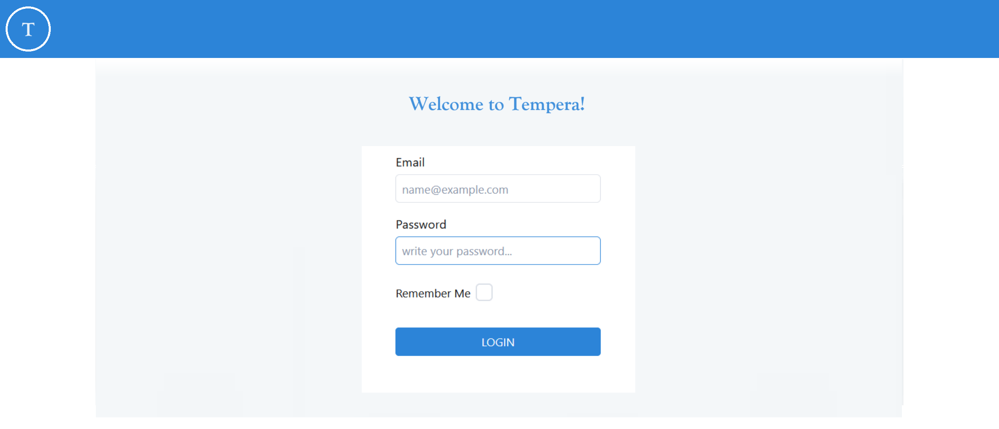

Employee - Overview on Homepage:

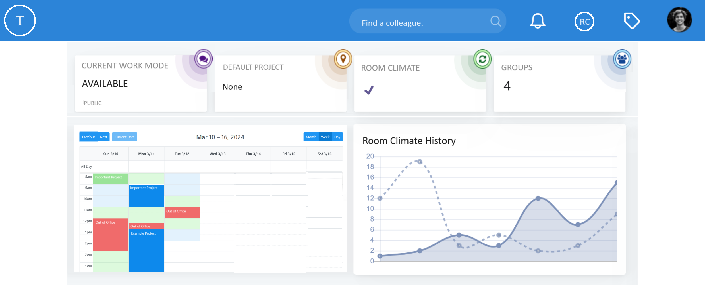

Employee - Manage Time Records:

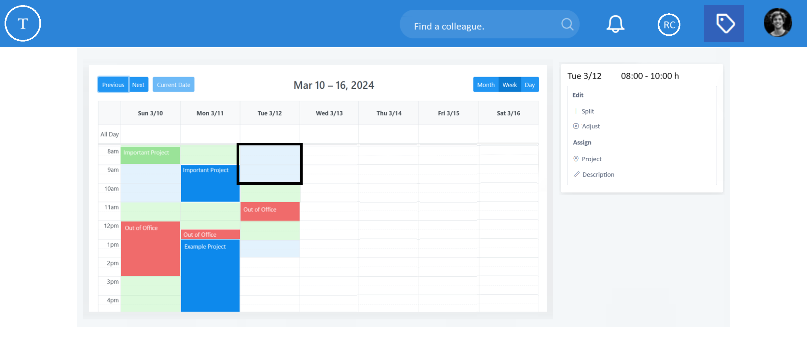

Employee - View Climate Data:

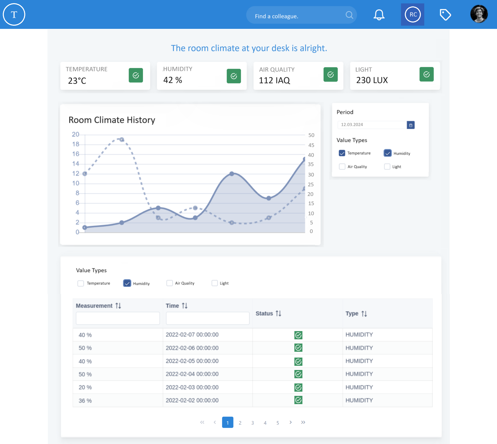

Employee - Warning:

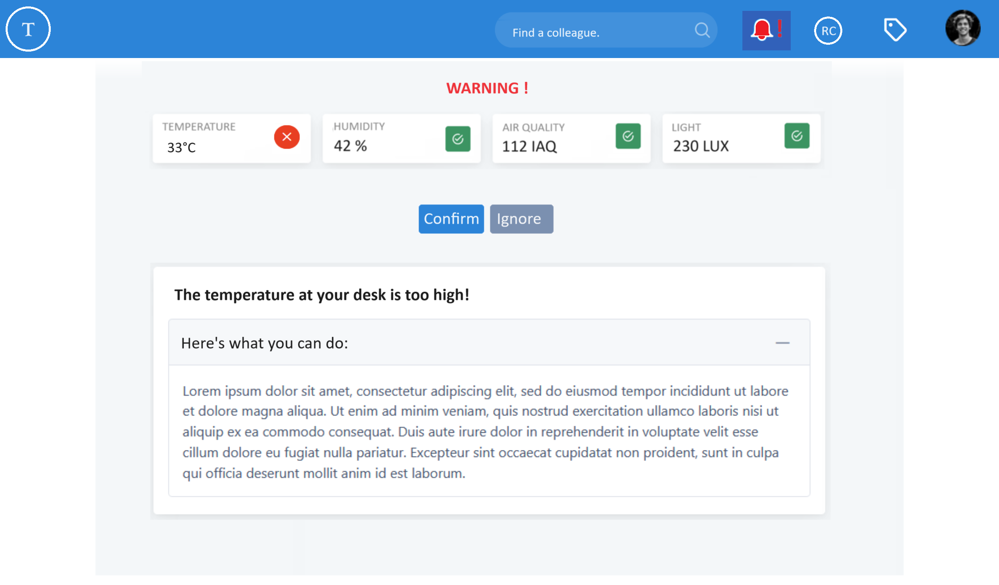

Group Leader - Manage Groups:

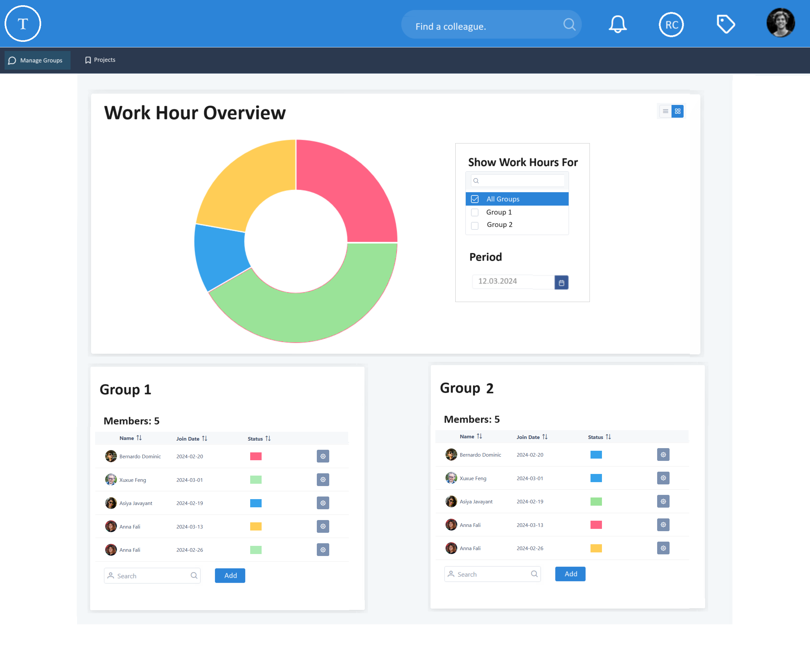

Admin - Manage Users:

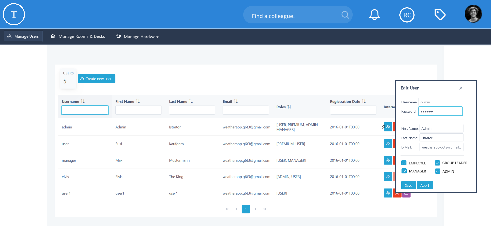

Admin - Manage Hardware:
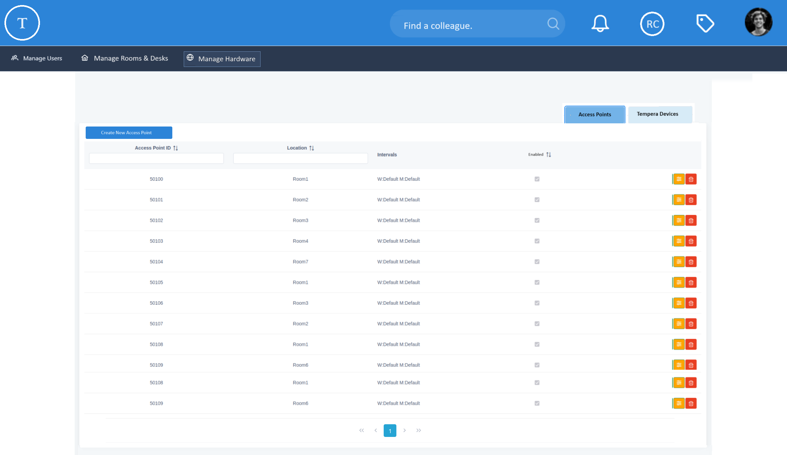

# 8. Project Plan

## 8.1. Responsibilities
The main responsibilities are divided into two teams *Team Hardware* which is responsible for the two hardware devices
*Arduino* and *Raspberry* and therefore also for the connection between the different devices. The second team (*Team 
WebApplication*) is responsible for the business logic as well as front- and backend.

These teams are not 100 percent clear-cut but the person in charge (listed below) is the responsible person for the given component.

### Team Hardware
- Arduino: Jonas Bayer [JB]
- Raspberry Pi: Astrid Reisinger [AR]

### Team WebApplication
- Front-End-Focus: Lea Hof [LH]
- Mid-Section-Focus: Niklas Speckle [NS]
- Database-Focus: Manuela Niedrist [MN]

## 8.2. Milestones

### Time Schedule

*Resp. = Main Responsibility*

### WebApplication

- [ ] Implement classdiagram in `model`
- [ ] REST Interface for data receive from `Accesspoint`
- [ ] Administration of `TemperaDevice`, `Accesspoint`, `Room`, `User` and `Limit` (administrator role)
- [ ] Recording and editing of working hours
- [ ] Manager role including management of `Project` and `Group` and analysis of working hours.
- [ ] Handling of limit transgression and warnings
- [ ] Display of climate data in `ui` as tables and graphs (including filtering and sorting)
- [ ] Display of working hours in `ui` as tables and graphs (including filtering and sorting). 
This also contains the function to see the `WorkMode` of colleagues.
- [ ] Logging
- [ ] Deletion policies

### Accesspoint

- [ ] Installation of `Accesspoint` via `./configure` script for admin
- [ ] Recieves "Hello World" from `Tempera` and sends to backend. Recognizes `Tempera` as BLE-Device.
- [ ] Recieves data from `Tempera`
- [ ] Database for interim storage of data
- [ ] Sends data to backend in regular time intervals
- [ ] Logging and warnings (on sensor errors)

### Arduino

- [ ] Circuit diagram
- [ ] Measurement of climate data (Sensor installation)
- [ ] Bluetooth-connection with "Hello World"
- [ ] Serial transmission of data
- [ ] Bluetooth-transmission of data
- [ ] `setup.exe` + ID
- [ ] control LED + blinking modus for errors
- [ ] Set `WorkMode`

### Addtional Tasks

- [ ] Interim Presentation. Präsentation on **27.05.**.
- [ ] Code Refactoring
- [ ] `JavaDoc` documentation while programming
- [ ] Final report including Software concept paper (submission version)
  - Tier-View (Verteilungssicht)
- [ ] Testbook and acceptance testing + Software ready for testing
- [ ] Documentation of acceptance testing of other team
- [ ] Unit-, componentn- and system-tests

## 8.3. Increments

| Date       | Increment                                                                                                                                                                                       |
|------------|-------------------------------------------------------------------------------------------------------------------------------------------------------------------------------------------------|
| 08.04.2024 | `model` and `repositories` component implemented, "Hellor World" transmission, `Management` component                                                                                            |
| 22.04.2024 | Administration of devices, display of climate in `ui`, `Room` component                                                                                                                         |
| 06.05.2024 | setup of `Tempera` via `setup.exe`, regular data transmission from `Accesspoint` to backend, logging of `Accesspoint`, Recording and editing of working hours, display of working hours in `ui` |
| 27.05.2024 | `configer` script for `Accesspoint` setup, all functionalities of software implemented, including logging, deletion policies and handling limit transgressions (`Climate` component).           |
| 10.06.2024 | Revision of software                                                                                                                                                                            |
| 21.06.2024 | Final version                                                                                                                                                                                   |